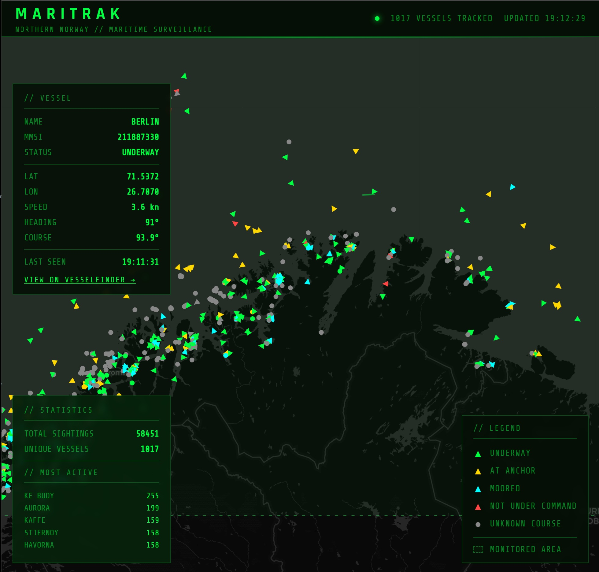

# MARITRAK
### Live Maritime Surveillance — Northern Norway & Barents Sea

A real-time AIS ship tracking application covering northern Norway and the Barents Sea. Built with Python, FastAPI, SQLite, and Leaflet.js.



---

## Features

- **Live AIS data stream** via [aisstream.io](https://aisstream.io), updated in real time
- **Interactive map** with color-coded vessel markers by navigational status
- **Course arrows** showing direction of travel for each vessel
- **Ship trails** — click any vessel to see its historical track
- **Vessel info panel** with speed, heading, course, MMSI, and navigational status
- **Statistics panel** showing total sightings, unique vessels, and most active ships
- **VesselFinder integration** — direct link to full vessel profile from the info panel
- **Auto-refresh** every 30 seconds
- Monitored area covers northern Norway, the Barents Sea, and the Kola Peninsula

## Tech Stack

| Layer | Technology |
|---|---|
| Data collection | Python, websockets, aiosqlite |
| Backend API | FastAPI, SQLite |
| Frontend | HTML, CSS, Vanilla JS |
| Map | Leaflet.js, CartoDB Dark tiles |
| Package management | uv |

## Project Structure

```
ship-tracker/
├── fetch_ships.py      # Connects to AIS stream and saves to database
├── api.py              # FastAPI backend serving ship data
├── static/
│   ├── index.html      # Frontend markup
│   ├── app.js          # Map logic, markers, trails, panels
│   └── style.css       # Tactical dark theme
├── .env                # API key (not committed)
├── .gitignore
└── pyproject.toml
```

## Getting Started

### Prerequisites

- Python 3.11+
- [uv](https://github.com/astral-sh/uv) package manager
- A free API key from [aisstream.io](https://aisstream.io)

### Installation

```bash
git clone https://github.com/DiscoJens/ship-tracker.git
cd ship-tracker
uv sync
```

### Configuration

Create a `.env` file in the project root and insert your api key in the following format:

```
AISSTREAM_API_KEY="your-api-key-here"
```

### Running

Open two terminals:

**Terminal 1 — start collecting ship data:**
```bash
uv run fetch_ships.py
```

**Terminal 2 — start the API and frontend:**
```bash
uv run uvicorn api:app
```

Then open [http://localhost:8000](http://localhost:8000) in your browser.

## API Endpoints

| Endpoint | Description |
|---|---|
| `GET /ships` | All sightings, newest first |
| `GET /ships/latest` | Latest position per unique vessel |
| `GET /ships/{name}/trail` | Full position history for a vessel |
| `GET /stats` | Total sightings, unique vessels, most active ships |

## Vessel Status Colors

| Color | Status |
|---|---|
| 🟢 Green | Underway |
| 🟡 Yellow | At anchor / Fishing |
| 🔵 Cyan | Moored |
| 🔴 Red | Not under command / Restricted / Aground |
| ⚫ Grey | Unknown |

## Data Collected

Each sighting stores: vessel name, MMSI, latitude, longitude, speed over ground, true heading, course over ground, navigational status, and timestamp.

---

Built as a demonstration of real-time data pipelines, REST API design, and geospatial visualization.
